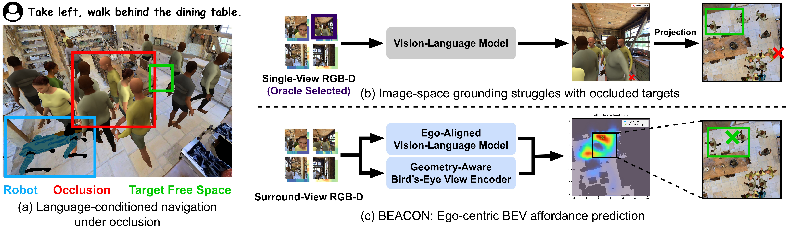
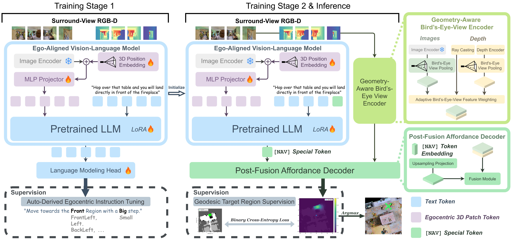

# BEACON: Language-Conditioned Navigation Affordance Prediction under Occlusion [IROS 2026]

[](https://arxiv.org/abs/2603.09961)
[](https://xin-yu-gao.github.io/beacon/)
[](https://github.com/facebookresearch/habitat-sim)
[](LICENSE)



[Xinyu Gao](https://xin-yu-gao.github.io), [Gang Chen](https://g-ch.github.io/), [Javier Alonso-Mora](https://autonomousrobots.nl/people/)


## ✅ To-Do List

- ✅ Release BEACON model implementation
- ✅ Release evaluation and metrics implementation
- ✅ Release zero-shot baseline adapters
- ✅ Release the data generation pipeline
- ⬜ Release the generated and processed data
- ⬜ Release pretrained checkpoints
- ⬜ Release consolidated environment files and update README again

The remaining resources will be released in follow-up updates.

## 📄 Abstract

Language-conditioned local navigation requires a robot to infer a nearby traversable target location from its current observation and an open-vocabulary, relational instruction. Existing vision-language spatial grounding methods usually rely on vision-language models (VLMs) to reason in image space, producing 2D predictions tied to visible pixels. As a result, they struggle to infer target locations in occluded regions, typically caused by furniture or moving humans. To address this issue, we propose BEACON, which predicts an ego-centric Bird's-Eye View (BEV) affordance heatmap over a bounded local region including occluded areas. Given an instruction and surround-view RGB-D observations from four directions around the robot, BEACON predicts the BEV heatmap by injecting spatial cues into a VLM and fusing the VLM's output with depth-derived BEV features. Using an occlusion-aware dataset built in the Habitat simulator, we conduct detailed experimental analysis to validate both our BEV space formulation and the design choices of each module. Our method improves the accuracy averaged across geodesic thresholds by 22.74 percentage points over the state-of-the-art image-space baseline on the validation subset with occluded target locations.

## 💡  Method

Given an instruction and surround-view RGB-D observations from four directions around the robot, BEACON predicts the BEV heatmap by injecting spatial cues into a VLM and fusing its output with geometry-aligned BEV features.

|  |
|:--:|
| **BEACON overview.** Stage 1 performs auto-derived ego-centric instruction tuning with ego-centric 3D position encoding to train the Ego-Aligned VLM. Stage 2 initializes the Ego-Aligned VLM weights from Stage 1, combines the resulting instruction-conditioned output with Geometry-Aware BEV features, and predicts an ego-centric BEV navigation affordance heatmap via a Post-Fusion Affordance Decoder. The two stages use different supervision signals, and inference selects the navigation target by taking the argmax. |

## 🧩 Project Structure

The repository is organized into three independent workflow directories. This
README is the single entry point; the structure below is a map.

```
BEACON/
├── README.md                   # this file
├── LICENSE                     # MIT (top-level BEACON code)
├── assets/images/              # overview.jpg, architecture.jpg
│
├── evaluation/                 # Workflow 1 — zero-shot baselines + unified metric
│   ├── pyproject.toml          # installs the vendored `robopoint` package
│   ├── environment_setup.sh
│   ├── baseline_adaptors/      # baseline_*.py, sharded_npz_evaluator.py,
│   │                           #   single_frame_evaluator.py (ExternalMetric)
│   └── robopoint/              # vendored upstream RoboPoint model (Apache-2.0)
│
├── model/                      # Workflow 2 — BEACON model (XTuner fork)
│   ├── setup.py                # installs the `xtuner` CLI
│   ├── requirements.txt
│   ├── tools/export_shards.py  # capture → shard_*.npz exporter
│   └── xtuner/                 # model, perception_modules, dataset,
│                               #   configs, evaluation metric
│
└── data_generation/            # Workflow 3 — dataset regeneration (runs on Falcon)
    ├── FALCON_PATCHES.md       # what the bundled Falcon patches change, and why
    ├── auto_save_pano.py       # panoramic RGB-D capture driver
    ├── create_random_peds.py   # pedestrian-trajectory generator
    └── falcon_patches/         # patched Falcon files to apply to your clone
```

## 🚀 Getting Started

BEACON ships as **three independent workflows** — evaluation & zero-shot baselines,
model training & inference, and data generation. Each workflow has its own
environment, inputs, and entry points; you can use any subset.

> **Asset status legend.** ✅ available now · ⬜ pending release ·
> 🔗 obtain from the linked third-party source.

> **Data flow.** Evaluation in Workflow 1 and the BEACON model in Workflow 2 both
> consume processed shards (`shard_*.npz`) that bundle RGB-D observations, camera
> poses, and ground-truth targets. Obtain shards either by downloading our release
> (⬜) or by running the [shard-export tool](#23-shard-export-for-the-zero-shot-baselines)
> on captures produced by Workflow 3. BEACON training reads captures and metadata
> directly and does not require shards.

---

### 1️⃣ Evaluation and Zero-Shot Baselines

<details>
<summary><b>Status:</b> adapters ✅ · unified evaluator ✅ · processed eval shards ⬜</summary>

Adaptors that run image-space navigation baselines on BEACON's exported shards and
score them with the same metric used for BEACON, so all methods are compared under
an identical protocol. Every baseline follows the same three-step pipeline:

```
shards (.npz)  ──▶  [1] infer: baseline_*.py  ──▶  candidate points (.npz)
                    [2] select: first / best / all
                    [3] score : sharded_npz_evaluator.py  ──▶  GeoAcc / EucAcc / SIR / SnapGeo
```

`sharded_npz_evaluator.py` performs steps [2] and [3] together.

**Contents** (`evaluation/`):

| Path | Role |
|---|---|
| `baseline_adaptors/baseline_robopoint.py` | RoboPoint-13B inference (single-view / oracle-view selection) |
| `baseline_adaptors/baseline_robopoint_oracle_bestgeohit.py` | Diagnostic upper bound: best-of-candidates by oracle geodesic hit |
| `baseline_adaptors/baseline_chatgpt.py` | GPT-4o inference (oracle-single-view or model-select-view) |
| `baseline_adaptors/baseline_roborefer.py` | RoboRefer-8B-SFT client (talks to an external RoboRefer server) |
| `baseline_adaptors/sharded_npz_evaluator.py` | Select + score candidates against the shards |
| `baseline_adaptors/sharded_result_selector.py` | Standalone candidate selection (`first` / `best`) |
| `baseline_adaptors/single_frame_evaluator.py` | `ExternalMetric` — the shared metric implementation |
| `baseline_adaptors/sharded_npz_loader.py` | Shard reader shared by all adaptors |
| `robopoint/` | Vendored upstream RoboPoint model package (Apache-2.0, see `robopoint/LICENSE`) |

#### 1.1 Inputs

| Asset | Location | Source | Status |
|---|---|---|---|
| Processed eval shards | `$SHARDS` (e.g. `processed_val_unseen_for_baselines/N11656_size200_full`) | BEACON release, or [Workflow 2 §2.3](#23-shard-export-for-the-zero-shot-baselines) | ⬜ |
| RoboPoint weights | HF cache | [`wentao-yuan/robopoint-v1-vicuna-v1.5-13b`](https://huggingface.co/wentao-yuan/robopoint-v1-vicuna-v1.5-13b) | 🔗 |
| OpenAI API key | file passed via `--api-key-path`, or `OPENAI_API_KEY` | [OpenAI](https://platform.openai.com/) | 🔗 |
| RoboRefer server | `http://127.0.0.1:25547` | [RoboRefer](https://github.com/Alice-yli/RoboRefer) | 🔗 |

#### 1.2 Environment

All adapters and the unified evaluator share one environment (`beacon-baselines`,
Python 3.10). The RoboRefer server itself runs in its own environment from the
upstream repo; only the lightweight client adapter lives here.

```bash
conda create -n beacon-baselines python=3.10 -y
conda activate beacon-baselines
pip install --upgrade pip
conda install -c nvidia cuda=12.1 -y     # optional, if you need a matching nvcc
cd evaluation
pip install -e .                          # installs the vendored `robopoint` package
pip install mmengine                      # required by the evaluator (ExternalMetric)
pip install openai                        # required only by the GPT-4o baseline
```

> A consolidated environment file for `beacon-baselines` is ⬜ pending release.

#### 1.3 Run Inference

```bash
conda activate beacon-baselines
cd evaluation

SHARDS=/path/to/processed_val_unseen_for_baselines/N11656_size200_full
OUT=/path/to/baseline_outputs

# RoboPoint-13B adapter
python baseline_adaptors/baseline_robopoint.py \
    --data-root "$SHARDS" \
    --output-dir "$OUT/robopoint_candidates" \
    --model-path wentao-yuan/robopoint-v1-vicuna-v1.5-13b \
    --temperature 0

# GPT-4o adapter (oracle single view; also supports --view-mode model_select_view)
python baseline_adaptors/baseline_chatgpt.py \
    --data-root "$SHARDS" \
    --output-dir "$OUT/chatgpt_oracle" \
    --view-mode oracle_single_view \
    --model-name gpt-4o-2024-05-13 \
    --api-key-path /path/to/openai_key.txt \
    --temperature 0

# RoboRefer adapter — start the upstream RoboRefer server first (separate env):
#   python api.py --port 25547 \
#     --depth_model_path /path/to/depth_anything_v2_vitl.pth \
#     --vlm_model_path  /path/to/RoboRefer-8B-SFT
python baseline_adaptors/baseline_roborefer.py \
    --data-root "$SHARDS" \
    --output-dir "$OUT/roborefer_candidates" \
    --server-url http://127.0.0.1:25547 \
    --enable-depth 1

# Optional diagnostic: oracle best-of-candidates upper bound (single .npz)
python baseline_adaptors/baseline_robopoint_oracle_bestgeohit.py \
    --data-root "$SHARDS" --output-path "$OUT/robopoint_oracle.npz" --temperature 0
```

#### 1.4 Unified Evaluation

```bash
python baseline_adaptors/sharded_npz_evaluator.py \
    --candidate-dir "$OUT/robopoint_candidates" \
    --dataset-root "$SHARDS" \
    --mode best \
    --match-mode order \
    --pattern "*.robopoint_candidates.npz"
```

- `--match-mode order` is required on the full validation split, where instruction
  tokens repeat across samples (order-based matching keeps predictions aligned).
- `--mode` selects which candidate to score: `first` (top-1), `best` (oracle-best), `all`.
- Adjust `--candidate-dir` and `--pattern` per adapter
  (`*.chatgpt_candidates.npz`, `*.roborefer_candidates.npz`).

Reports **GeoAcc** (geodesic accuracy across thresholds), **EucAcc** (Euclidean
accuracy), **SIR** (structural invalid rate), and **SnapGeo** (geodesic accuracy
after snapping to free space), at thresholds {0.5, 1.0, 1.5} m over the full set
and the goal-occluded subset.

#### 1.5 Outputs

- `$OUT/<adapter>/*_candidates.npz` — per-sample candidate target predictions
- evaluator stdout — metric table per adapter

> **Attribution.** `robopoint/` is the upstream
> [RoboPoint](https://github.com/wentao-yuan/robopoint) model package, licensed
> Apache-2.0 (see `robopoint/LICENSE`). The adaptors under `baseline_adaptors/`
> are BEACON's own code (MIT, see the top-level `LICENSE`).

</details>

---

### 2️⃣ BEACON Model

<details>
<summary><b>Status:</b> model code ✅ · stage configs ✅ · shard exporter ✅ · checkpoints ⬜ · processed data ⬜ · env file ⬜</summary>

The BEACON model is a fork of [XTuner](https://github.com/InternLM/xtuner)
(v0.2.0, Apache-2.0) with the BEACON perception modules, dataset loaders, metric,
and the two-stage training configs added on top. Installing `model/` provides the
`xtuner` CLI used for training and evaluation.

**Layout** (`model/`):

| Path | Role |
|---|---|
| `xtuner/model/internvl.py` | `InternVL_V1_5_NavTarget` — Ego-Aligned VLM + navigation head wiring |
| `xtuner/perception_modules/affordance_head.py` | `AffordanceHead` — Post-Fusion Affordance Decoder (`catbev` / `mlpxy` / `attnxy` / `plainbev` variants) |
| `xtuner/perception_modules/oracle_bev.py` | `BEVMaskGenerator` — oracle BEV traversability masks (optional branch, see notes) |
| `xtuner/dataset/internvl_dataset.py` | `InternVL_V1_5_Dataset_Multiview_PKL` — reads the metadata `.pkl` + 4-view captures |
| `xtuner/dataset/habitat_panoramic_dataset.py` | `HabitatPanoramicDataset` — panoramic capture loader |
| `xtuner/evaluation/metrics/external_metric.py` | `ExternalMetric` — GeoAcc / EucAcc / SIR / SnapGeo |
| `xtuner/configs/internvl/v2_custom/` | The 10 released training/eval configs (see [§2.4](#24-training)) |
| `tools/export_shards.py` | Capture → `shard_*.npz` exporter for the zero-shot baselines |

#### 2.1 Inputs

| Asset | Location | Source | Status |
|---|---|---|---|
| InternVL2-2B base | `$BEACON_MODEL_ROOT/OpenGVLab/InternVL2-2B/` | [OpenGVLab/InternVL2-2B](https://huggingface.co/OpenGVLab/InternVL2-2B) | 🔗 |
| DINOv2 backbone (local clone) | `$BEACON_DINOV2_ROOT/facebookresearch_dinov2_main/` | [facebookresearch/dinov2](https://github.com/facebookresearch/dinov2) | 🔗 |
| Training metadata | `$BEACON_DATA_ROOT/{train,val_unseen}.pkl` | BEACON release | ⬜ |
| Captures | `$BEACON_DATA_ROOT/captures/` | [Workflow 3](#3️⃣-data-generation-optional) or BEACON release | ⬜ |
| Stage-1 checkpoint | `$BEACON_WORK_ROOT/work_dir/QA_PE3D_True_batch4x2_lr3e-05_epoch1_/` | BEACON release, or train Stage 1 | ⬜ |
| Stage-2 checkpoint | `work_dir/catbev_PE3D_True_batch4x2_lr2e-05x5_epoch1_/` | BEACON release, or train Stage 2 | ⬜ |

#### 2.2 Environment

Built on the XTuner fork with the MMCV2 stack. A consolidated environment file is
⬜ pending release.

```bash
conda create -n beacon-model python=3.10 -y
conda activate beacon-model
cd model
pip install -e .            # installs the `xtuner` CLI + BEACON modules
```

> `requirements.txt` is the upstream XTuner set and is **not complete** for
> BEACON. The model/perception modules additionally hard-import `mmcv` (MMCV2 —
> `mmcv.ops` / `mmcv.cnn`), `mmdet3d`, `timm`, `diffusers`, `plotly`, and `spacy`
> at module load, so `pip install -e .` alone will raise `ModuleNotFoundError`.
> `mmcv` / `mmdet3d` are version-sensitive against `mmengine==0.10.6`; install the
> MMCV2 build matching your CUDA/torch (see the
> [MMCV install guide](https://mmcv.readthedocs.io/en/latest/get_started/installation.html)).
> The `spacy` model `en_core_web_sm` is only needed for the optional GroundingDINO
> path (not used in the released train/eval).

Configure the path roots (defaults match the original HPC container layout, where
data was bind-mounted at `/data`, weights at `/model`, code/work dir at `/workspace`):

```bash
export BEACON_DATA_ROOT=/abs/path/to/data       # default /data
export BEACON_MODEL_ROOT=/abs/path/to/models    # default /model
export BEACON_WORK_ROOT=/abs/path/to/workspace  # default /workspace (Stage-2 load_from base)
export BEACON_DINOV2_ROOT=/abs/path/to/DINOv2   # default /model/DINOv2
```

Expected layout under those roots:

```
$BEACON_MODEL_ROOT/OpenGVLab/InternVL2-2B/          # base VLM
$BEACON_DINOV2_ROOT/facebookresearch_dinov2_main/   # local clone of facebookresearch/dinov2
$BEACON_DATA_ROOT/train.pkl                         # Stage-1/2 training metadata
$BEACON_DATA_ROOT/val_unseen.pkl                    # validation metadata
$BEACON_DATA_ROOT/captures/                         # 4-view RGB-D captures (dataset_root)
$BEACON_WORK_ROOT/work_dir/QA_PE3D_True_batch4x2_lr3e-05_epoch1_/iter_18779.pth  # Stage-1 ckpt
```

> DINOv2 is loaded from a **local clone**, not the torch hub cache:
> `AffordanceHead` calls `torch.hub.load(..., source="local")` on
> `$BEACON_DINOV2_ROOT/facebookresearch_dinov2_main`, so clone
> [facebookresearch/dinov2](https://github.com/facebookresearch/dinov2) there
> (the directory must be named `facebookresearch_dinov2_main`).

Optional environment variables (only for the disabled/optional paths):
`BEACON_ORACLE_BEV_ANN` / `BEACON_ORACLE_BEV_OUT` (oracle-BEV branch, off by
default), `BEACON_OCC_DUMP` (metric debug dump), `BEACON_CACHE_ROOT` +
`FALCON_DATA_ROOT` (freespace-loss cache, off by default), and `GSA_ROOT` /
`GROUNDINGDINO_CONFIG` / `GROUNDINGDINO_CKPT` / `BEACON_AO_PLANNER_ROOT`
(optional GroundingDINO).

#### 2.3 Shard Export (for the zero-shot baselines)

Converts captures + metadata into the `shard_*.npz` format consumed by Workflow 1.
Runs in the `beacon-model` environment. Every setting is an argparse flag whose
default matches the original container value, so running with no arguments
reproduces the original export.

```bash
conda activate beacon-model
cd model

python tools/export_shards.py \
    --model-path       "$BEACON_MODEL_ROOT/OpenGVLab/InternVL2-2B" \
    --pkl-path         "$BEACON_DATA_ROOT/val_unseen.pkl" \
    --pkl-dataset-root "$BEACON_DATA_ROOT/captures" \
    --out-root         "$BEACON_DATA_ROOT/processed_val_unseen_for_baselines" \
    --samples-per-shard 200
```

Flags: `--seed` (0), `--output-mode` (`Affordance_eval`), `--samples-per-shard`
(200), `--max-shards` (-1 = all), `--model-path`, `--pkl-path`,
`--pkl-dataset-root`, `--max-length` (1536), `--expected-total-len` (11656; the
exporter asserts the dataset length against this — override for a different
split), `--out-root`.

#### 2.4 Training

Two stages. Stage 1 trains the Ego-Aligned VLM with auto-derived ego-centric
instruction tuning (`output_mode="VQA"`); Stage 2 initializes from the Stage-1
checkpoint and trains the Post-Fusion Affordance Decoder (`output_mode="Affordance"`).

```bash
conda activate beacon-model
cd model

# Stage 1 — ego-centric instruction tuning (Ego-Aligned VLM)
PYTHONPATH=. xtuner train \
    xtuner/configs/internvl/v2_custom/QA_PE3D_True_batch4x2_lr3e-05_epoch1.py

# Stage 2 — post-fusion affordance decoding (FINAL BEACON; loads the Stage-1 ckpt)
PYTHONPATH=. xtuner train \
    xtuner/configs/internvl/v2_custom/catbev_PE3D_True_batch4x2_lr2e-05x5_epoch1.py
```

Checkpoints and logs are written to `work_dir/<config_name>/` (relative to the
`model/` dir unless overridden). All 10 released configs live under
`xtuner/configs/internvl/v2_custom/`; `PE3D_True/False` in the filename maps to
`use_pe3d` (ego-centric 3D position encoding on/off), and `is_stage2=True` means
the config initializes from the Stage-1 checkpoint.

| Config | Stage | `output_mode` | `method_variant` | PE3D | `is_stage2` | lr | head× | Role |
|---|---|---|---|---|---|---|---|---|
| `QA_PE3D_True_batch4x2_lr3e-05_epoch1` | 1 | VQA | — | ✅ | False | 3e-5 | — | **Stage-1** instruction tuning (with ego-3D PE) |
| `QA_PE3D_False_batch4x2_lr3e-05_epoch1` | 1 | VQA | — | ❌ | False | 3e-5 | — | Stage-1 ablation (no PE) |
| `catbev_PE3D_True_batch4x2_lr2e-05x5_epoch1` | 2 | Affordance | catbev | ✅ | True | 2e-5 | 5 | **FINAL BEACON** |
| `catbev_PE3D_True_batch4x2_lr2e-05x5_epoch1_fromnone` | 2 | Affordance | catbev | ✅ | False | 2e-5 | 5 | Ablation: no Stage-1 init |
| `catbev_PE3D_False_batch4x2_lr2e-05x5_epoch1` | 2 | Affordance | catbev | ❌ | True | 2e-5 | 5 | Ablation: no PE |
| `catbev_PE3D_False_batch4x2_lr2e-05x5_epoch1_fromnone` | 2 | Affordance | catbev | ❌ | False | 2e-5 | 5 | Ablation: no PE, no Stage-1 init |
| `mlpxy_PE3D_True_batch4x2_lr2e-05x1_epoch1` | 2 | Affordance | mlpxy | ✅ | True | 2e-5 | 1 | Ablation: MLP head (no BEV fusion) |
| `mlpxy_PE3D_False_batch4x2_lr2e-05_epoch1` | 2 | Affordance | mlpxy | ❌ | False | 2e-5 | — | Ablation: MLP head, no PE, no Stage-1 init |
| `attnxy_PE3D_True_batch4x2_lr2e-05x5_epoch1` | 2 | Affordance | attnxy | ✅ | True | 2e-5 | 5 | Ablation: attention head |
| `plainbev_PE3D_True_batch4x2_lr2e-05x5_epoch1` | 2 | Affordance | plainbev | ✅ | True | 2e-5 | 5 | Ablation: plain BEV fusion |

#### 2.5 Evaluation

```bash
PYTHONPATH=. xtuner test \
    xtuner/configs/internvl/v2_custom/catbev_PE3D_True_batch4x2_lr2e-05x5_epoch1.py \
    --checkpoint work_dir/catbev_PE3D_True_batch4x2_lr2e-05x5_epoch1_/iter_<N>.pth
```

`xtuner test` runs `ExternalMetric` **inline**: it prints GeoAcc / EucAcc / SIR /
SnapGeo at {0.5, 1.0, 1.5} m over the full validation set and the goal-occluded
subset, and writes predictions to the npz at `test_evaluator.save_path` (under
`work_dir/`). These are BEACON's own numbers. The `sharded_npz_evaluator.py` in
Workflow 1 scores the **zero-shot baselines**, not BEACON's `xtuner test`.
`<N>` is the saved iteration (e.g. `iter_18779.pth`); with `save_last=True`,
MMEngine also writes a `last_checkpoint` file recording the latest path.

#### 2.6 Outputs

- `work_dir/<config_name>/` — training checkpoints (`iter_<N>.pth`), logs, and the
  evaluation prediction npz
- stdout — the `ExternalMetric` table (GeoAcc / EucAcc / SIR / SnapGeo)

#### 2.7 Notes

- **Nothing but code is bundled.** Checkpoints and the processed `.pkl`/captures
  are ⬜ pending release; the base VLM and DINOv2 are 🔗 external. Until the data
  is released you can read and extend the code but cannot train/eval end-to-end.
- **All 10 configs include a `WandbVisBackend`** (project `thesis_hpc`). Training
  will try to initialize W&B — set `WANDB_MODE=offline` (or `disabled`), or delete
  the `WandbVisBackend` entry from `vis_backends` if you do not use it.
- **Stage-2 `load_from` hardcodes the author's Stage-1 checkpoint**
  (`.../QA_PE3D_True_batch4x2_lr3e-05_epoch1_/iter_18779.pth`). Retrain Stage 1
  and edit `load_from` to your own checkpoint, or use a `_fromnone` config to skip
  Stage-1 init.
- **The oracle-BEV / freespace branch is disabled** (`use_freespace_loss = False`
  in `internvl_dataset.py`). `BEVMaskGenerator`'s `ann_file` / `out_dir` are
  placeholders read only if that branch is re-enabled.
- **GroundingDINO / `BoxPipeline`** (`xtuner/dataset/grounding_dino_pipeline.py`)
  is optional and is not instantiated in the released train/eval paths. Set
  `GSA_ROOT` (and optionally `GROUNDINGDINO_CONFIG` / `GROUNDINGDINO_CKPT`) to
  enable it.
- **Research code released as-is.** Commented-out debug blocks and a few dead
  helper paths remain; `mmdet3d` / `mmcv` / `mmengine` are hard imports.

</details>

---

### 3️⃣ Data Generation (optional)

<details>
<summary><b>Status:</b> pipeline code ✅ · Falcon patches ✅ · MP3D scenes 🔗 · Social-MP3D episodes 🔗 · Falcon env 🔗 · env file ⬜</summary>

Only needed if you want to regenerate the BEACON dataset from scratch. Most users
can skip this workflow and use the released processed shards
([Workflow 1 §1.1](#11-inputs)) directly.

> **What is and is not bundled.** This pipeline runs **on top of
> [Falcon](https://github.com/Zeying-Gong/Falcon)** (a habitat-lab / habitat-sim
> fork with multi-agent social navigation). BEACON's data generation used the
> author's **private fork of Falcon** (762 files, mostly upstream code), which is
> **not bundled and cannot be released in full**. The two scripts here therefore
> **do not run standalone** — they must be placed at the root of your own Falcon
> clone. The three files the author actually modified (a custom pedestrian action
> class and two 200-human config files, which do **not** exist in upstream Falcon
> `main`) **are** bundled as drop-in patches under
> [`data_generation/falcon_patches/`](data_generation/falcon_patches/);
> [`data_generation/FALCON_PATCHES.md`](data_generation/FALCON_PATCHES.md) records
> what each change does and why.

**Contents** (`data_generation/`):

| File | Status | Description |
|---|---|---|
| `auto_save_pano.py` | ✅ | Data-generation driver: teleports a Spot robot through MP3D connectivity waypoints in a crowded scene, captures panoramic RGB-D (dynamic + static replay), writes a `Landmark-RxR-dynamic` metadata `.pkl`. Only hardcoded personal paths were made env-var configurable — no logic changes. |
| `create_random_peds.py` | ✅ | Pedestrian-trajectory generator: samples human starts on an inflated navmesh, rolls out coverage-optimized, collision-avoiding trajectories per floor, saves one merged episode to `crowd-mp3d/{split}/content/{scan_id}.json.gz`. Only paths were de-hardcoded. |
| `FALCON_PATCHES.md` | ✅ | Exact list of changes made to upstream Falcon (action-class flags, yaml speeds, threshold tricks), with fork line numbers. |
| `falcon_patches/` | ✅ | Drop-in replacements for the 3 modified Falcon files: `falcon/additional_action.py`, `orca_mp3d.yaml`, `orca_mp3d_task.yaml`. |
| Generated captures / processed data | ⬜ | `data/captures_*` outputs; most users can skip this workflow and use the released shards. |

#### 3.1 Inputs

| Asset | Location | Source | Status |
|---|---|---|---|
| Falcon environment | your Falcon clone | [Falcon](https://github.com/Zeying-Gong/Falcon) | 🔗 |
| BEACON Falcon patches | `data_generation/falcon_patches/` | this repo (apply to your clone) | ✅ |
| Matterport3D scenes | `data/scene_datasets/mp3d/` | [Matterport3D](https://niessner.github.io/Matterport/) (license required) | 🔗 |
| Social-MP3D episodes | `data/datasets/pointnav/social-mp3d/` | [Falcon](https://github.com/Zeying-Gong/Falcon) | 🔗 |
| Humanoid & bench assets | `data/` | `habitat_sim.utils.datasets_download` | 🔗 |

#### 3.2 Environment

The pipeline was built in conda env `falcon`, **Python 3.9**, with
**habitat-sim 0.3.1** (`withbullet`) and habitat-lab + habitat-baselines installed
editable from the Falcon fork. A consolidated environment file is ⬜ pending
release; the install steps are:

```bash
conda create -n falcon python=3.9 cmake=3.14.0
conda activate falcon
mamba install habitat-sim=0.3.1 withbullet -c conda-forge -c aihabitat
# inside your Falcon clone:
pip install -e habitat-lab
pip install -e habitat-baselines
pip install -r requirements.txt
```

Then apply the BEACON patches and copy the two scripts to the **root of your
Falcon clone**:

```bash
# from your Falcon clone root
cp -r /path/to/BEACON/data_generation/falcon_patches/falcon            falcon/            # merge
cp -r /path/to/BEACON/data_generation/falcon_patches/habitat-baselines habitat-baselines/ # merge
cp -r /path/to/BEACON/data_generation/falcon_patches/habitat-lab       habitat-lab/       # merge
cp /path/to/BEACON/data_generation/auto_save_pano.py     .
cp /path/to/BEACON/data_generation/create_random_peds.py .

# multi-agent assets + link the MP3D scenes
python -m habitat_sim.utils.datasets_download \
  --uids hab3-episodes habitat_humanoids hab3_bench_assets hab_spot_arm \
  --data-path data/
ln -s $MP3D_ROOT data/scene_datasets/mp3d
```

Configure the dataset roots via environment variables (`MP3D_ROOT` and
`FALCON_DATA_ROOT` are read by both scripts; `MP3D_CONNECTIVITY` only by
`auto_save_pano.py`; `BEACON_VIS_DIR` only by `create_random_peds.py`):

```bash
export MP3D_ROOT=/abs/path/to/mp3d_habitat/mp3d          # both scripts: scene datasets root
export MP3D_CONNECTIVITY=/abs/path/to/Matterport3DSimulator/connectivity  # auto_save_pano.py
export FALCON_DATA_ROOT=/abs/path/to/Falcon/data         # both scripts: datasets + scene_datasets
export BEACON_VIS_DIR=vis                                # optional: create_random_peds.py debug PNGs
```

#### 3.3 Run (per scan)

The scripts are research code with **in-file knobs** (no CLI arguments). Set
`scan_id` in `create_random_peds.py` and `SCAN_ID` / `SEED` in `auto_save_pano.py`
(seed convention: 42 for train, 0 for val). Make sure the target scan's
`crowd-mp3d/{train,val}/content/` folders contain only that scan's `.json.gz`
(the driver auto-detects the split but loads whatever is present). Then run from
the Falcon clone root:

```bash
# 1. Generate pedestrian trajectories for the scan (writes crowd-mp3d gz)
PYTHONPATH=.:habitat-baselines:habitat-lab python create_random_peds.py

# 2. Capture dynamic + static panoramic RGB-D
PYTHONPATH=.:habitat-baselines:habitat-lab python auto_save_pano.py
```

#### 3.4 Outputs

Under `data/0_FULL_DATA/captures_v3_{split}_{SCAN_ID}/`:

- `dynamic_mp3d_viewpoints/{rgb,depth}/` — crowded captures at MP3D connectivity
  waypoints (token = MP3D viewpoint hash)
- `static_mp3d_viewpoints/{rgb,depth}/`, `static/{rgb,depth}/` — human-free replay
  of the same poses
- `scan{SCAN_ID}_Landmark-RxR-dynamic.pkl` — per-frame poses, human poses, and
  image/depth paths (Landmark-RxR-style `data_list`)

Feed the captures into [Workflow 2 §2.3](#23-shard-export-for-the-zero-shot-baselines)
to produce the processed shards used for evaluation.

> **Notes.** The scripts are module-level executables (no CLI args) with a few
> preserved quirks documented at the top of `create_random_peds.py`. If capture
> fails with "Overlap not resolved at waypoint …", change `SEED` and rerun. The
> exact upstream Falcon commit the fork was based on is not recorded;
> `FALCON_PATCHES.md` compares against upstream `main` as of 2026-09-25.

</details>

## 📚 Citation

If you find this work useful, please consider citing:

```bibtex
@article{gao2026beacon,
  title={BEACON: Language-Conditioned Navigation Affordance Prediction under Occlusion},
  author={Gao, Xinyu and Chen, Gang and Alonso-Mora, Javier},
  journal={arXiv preprint arXiv:2603.09961},
  year={2026}
}
```

## ⭐ Acknowledgements

Many thanks to these excellent open source projects:

- [XTuner](https://github.com/InternLM/xtuner)
- [Falcon](https://github.com/Zeying-Gong/Falcon)
- [RoboPoint](https://github.com/wentao-yuan/robopoint)
- [RoboRefer](https://github.com/Alice-yli/RoboRefer)
- [Habitat-Lab](https://github.com/facebookresearch/habitat-lab)
- [Habitat-Sim](https://github.com/facebookresearch/habitat-sim)
- [BEVFusion](https://github.com/mit-han-lab/bevfusion)
